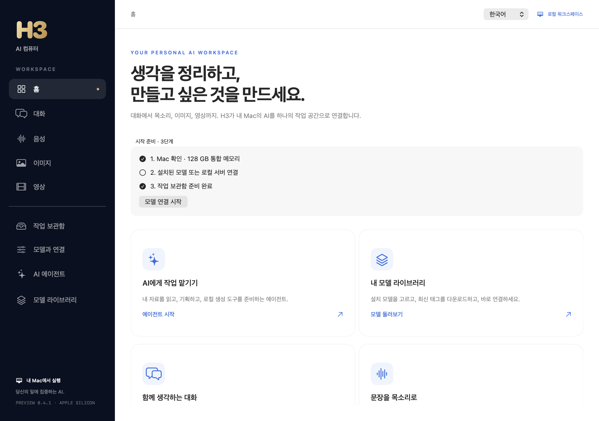
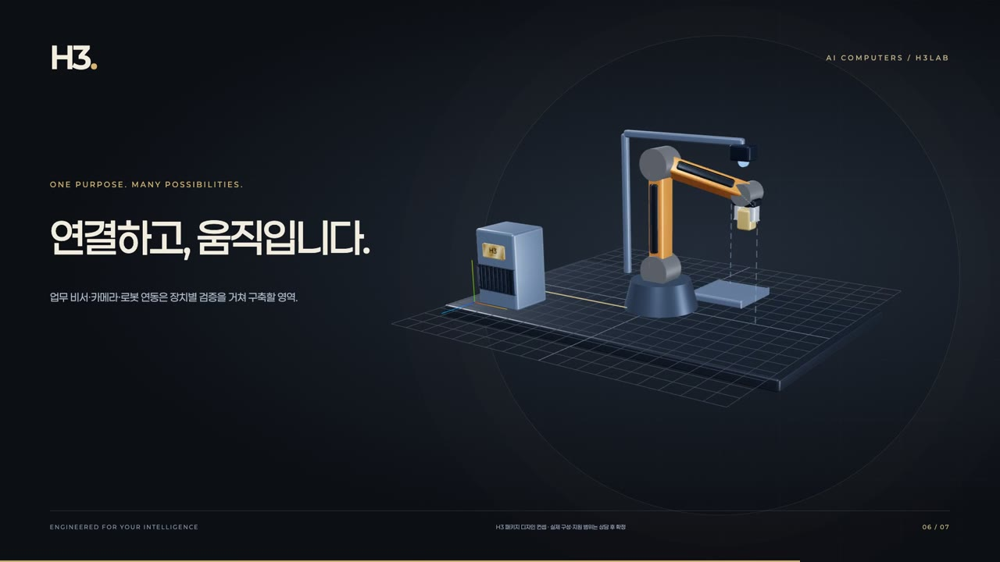
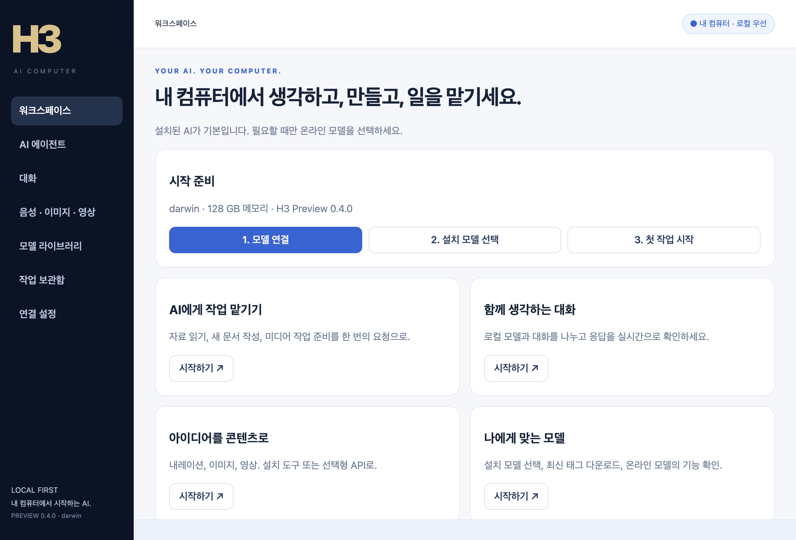

# H3 · AI 컴퓨터

**생각을 만들고, 세상을 움직이다.**

[English](README.md) · [H3Lab](https://h3lab.kr/) · [제품 쇼케이스](apps/web/README.md) · [Mac 앱 안내](docs/public/MAC-APP.md) · [개발·협업](CONTRIBUTING.md)

H3는 **당신의 목적에 맞춰 하드웨어와 AI를 함께 설계하는 컴퓨터 브랜드**입니다. 글을 쓰고, 목소리를 만들고, 이미지를 그리고, 영상을 제작합니다. 업무를 함께 풀어가는 비서에서 연결된 장치의 작업을 조율하는 시스템까지, AI 컴퓨터의 쓰임을 넓혀갑니다.

H3Lab은 공개 모델과 글로벌 기술팀의 실행 기술을 바탕으로, **사용자가 실제로 활용할 수 있는 AI 환경**에 집중합니다. 필요한 컴퓨터를 고르고, 모델과 도구를 연결하고, 결과를 확인하는 경험을 하나로 만듭니다.

## 30초로 만나는 H3

컴퓨터의 정교한 내부부터 책상 위 창작 환경, 연결된 장치의 미래까지. 홈페이지의 3D 제품 디자인을 담은 브랜드 필름입니다. 아래에서 한국어 영상을 바로 재생할 수 있습니다.

### 한국어 · 30초

https://github.com/user-attachments/assets/a0556e92-18eb-4e7a-a674-1fc9a6585e98

Full HD · AI 합성 나레이션 · 오리지널 음악 · 언어별 자막

### Mac Preview 0.5.0 · 컴퓨터를 움직이는 AI

AI 에이전트에서 대상 앱을 선택하면 **화면 요소 읽기, 앱 활성화, 버튼 누르기, 텍스트 입력**을 요청할 수 있습니다. 로컬 AI가 기본이며, 선택형 Codex·Claude에도 같은 실행·승인 흐름을 적용합니다. 한국어와 영어 UI를 지원합니다.

실행할 앱과 내용을 확인하고 승인하세요. 중단하면 다음 동작을 차단합니다. Mac 손쉬운 사용 권한과 접근성 요소를 제공하는 앱이 필요하며, Windows/Linux 데스크톱 제어는 후속 단계입니다.

[14개 주요 AI 앱·도구 조사와 제품 전략](docs/public/AI-COMPUTER-STRATEGY-20260909.md) · [컴퓨터 제어 사용법과 검증 범위](docs/public/MAC-050-RELEASE.md)

### Mac Preview 0.4.1의 새로운 경험

스트리밍 응답, 대화·생성 초안 자동 저장, 로컬 서버 찾기, 첫 실행 안내와 같은 설정으로 새 작업 만들기를 제공합니다. 네이비·블루 화면과 골드 H3 아이콘으로 브랜드 경험을 연결합니다.

앱 상단에서 **한국어 / English**를 재시작 없이 전환합니다. Preview 0.4.1은 음성 생성 후 미리보기에서 앱이 종료되는 문제를 수정했습니다.



[Mac Preview 다운로드](apps/web/public/downloads/H3-Mac-0.5.0-preview.zip) · [설치 및 변경 안내](docs/public/MAC-APP.md) · [제품화 로드맵](docs/public/MAC-PRODUCT-PLAN.md)

## 하나의 컴퓨터, 다양한 가능성

| 작업 | H3에서 할 수 있는 일 |
|---|---|
| **대화** | 문서 정리·아이디어 탐색·개발 보조를 위한 로컬 모델 연결, 모델 선택과 대화 |
| **음성** | 한국어 음성 생성, 화자 선택, 나레이션과 안내 음성의 WAV 미리보기 |
| **이미지** | 이미지 생성, 해상도·스텝·시드 설정, 결과 미리보기 |
| **영상** | MiniMax H3 기반 영상·오디오 생성, 시작 이미지 입력, 8스텝 기본 제작 흐름 |
| **작업 보관함** | 입력·설정·원본·로그를 한 작업으로 보관하고 최신순으로 다시 확인 |

**현재 Mac 앱은 개발자 Preview 0.5.0입니다.** SwiftUI 기반 네이티브 화면에서 대화·음성·이미지·영상 도구를 다루고, 모델 연결과 작업 기록을 함께 관리합니다.

## 목적에 맞는 AI 컴퓨터

컴퓨터의 구성은 사용하려는 모델과 작업에서 시작합니다. GPU·메모리·저장 공간·전력·냉각에 실행 환경을 더해, 개인과 팀에 맞는 구성을 설계합니다.

<table>
<tr>
<td width="50%" align="center"><br><b>H3 Performance · NVIDIA RTX</b></td>
<td width="50%" align="center"><br><b>H3 Mini · Mac mini</b></td>
</tr>
<tr>
<td width="50%" align="center"><br><b>H3 Mac Studio</b></td>
<td width="50%" align="center"><br><b>H3 Mac Pro · 보유 장비 활용</b></td>
</tr>
</table>

홈페이지의 3D 모델을 사용한 H3 패키지 디자인 컨셉입니다. 제품을 회전하고 내부를 펼쳐 보는 화면은 [제품 쇼케이스](apps/web/README.md)에서 실행할 수 있습니다.

| 제품군 | 구성 방향 |
|---|---|
| **H3 Core · NVIDIA** | 개인 업무와 작은 창작을 위한 AI 컴퓨터 |
| **H3 Studio · NVIDIA** | 크리에이터·개발자·스튜디오의 이미지·영상 작업 환경 |
| **H3 Pro · NVIDIA** | 연구팀·전문 제작·사내 AI를 위한 맞춤 구성 |
| **H3 Mini · Mac mini** | 작은 책상 위에 만드는 개인 AI 작업실 |
| **H3 Mac Studio** | 로컬 모델과 창작 도구를 연결하는 제작 환경 |
| **H3 Mac Pro** | 보유한 Apple Silicon Mac Pro를 활용하는 AI 환경 설계 |

제품별 구성 제안과 도입 방식은 [NVIDIA 패키지 안내](docs/public/NVIDIA-PACKAGES.md), [Mac 앱 안내](docs/public/MAC-APP.md)에서 확인할 수 있습니다.

## 보고, 움직이고, 경험하는 H3

한영 브랜드 홈페이지는 H3 AI 컴퓨터의 제품과 비전을 직접 경험하는 공간입니다.

- **인터랙티브 3D 제품:** RTX 본체를 펼쳐 냉각계·기판·배선을 살펴보고, Mac 패키지를 회전하며 확인합니다.
- **Blue & Gold:** 네이비·블루와 밝은 실버, 골드 H3 배지, 페이퍼로지 서체로 브랜드를 표현합니다.
- **로보틱스 랩:** 요청 → 실행 승인 → 제품 이동의 연결 흐름을 3D 시뮬레이션으로 체험합니다.
- **한국어·영어:** 본문·제품 소개·상담창과 영상·나레이션·자막을 언어에 맞게 제공합니다.

## 만들고, 돕고, 연결하는 컴퓨터



**대화와 콘텐츠 제작에서, 실제 작업을 조율하는 AI 컴퓨터로.** 홈페이지의 로보틱스 랩은 H3 컴퓨터·로봇 팔·카메라를 하나의 작업 셀로 표현합니다. 방문자는 제품 촬영 요청을 시작하고, 실행을 승인하고, 동작을 일시 정지하거나 다시 시작할 수 있습니다.

현재 제공하는 인터랙티브 시뮬레이션을 통해 **요청 이해 → 계획 → 승인 → 동작 → 결과 확인**이라는 확장 방향을 보여줍니다. 실제 장치 연결은 하드웨어별 검증을 통해 발전시킵니다.

## 데스크톱 다운로드 · Preview 0.4

**설치된 로컬 모델이 기본입니다. 온라인 AI는 필요할 때 선택합니다.** 로컬 대화·에이전트, Ollama 모델 다운로드·업데이트, OpenRouter API, 선택형 Codex·Claude 브레인과 생성 기록을 공통 데스크톱 앱으로 제공합니다.

[Windows · Linux · macOS 다운로드](https://github.com/H3Lab-kr/H3-AIComputer/releases/tag/v0.4.0-preview.1) · [설치 및 지원 범위](apps/desktop/README.md)



## Mac에서 시작하기

Apple Silicon Mac, macOS 14 이상, Apple Command Line Tools를 준비합니다.

```sh
bash scripts/build-mac-app.sh
open "dist/H3.app"
```

1. **모델과 연결**에서 로컬 서버나 설치된 모델·실행 도구를 연결합니다.
2. **대화·음성·이미지·영상**에서 할 일을 고릅니다.
3. **작업 준비 → 설정 확인 → 생성**으로 진행하고, 결과를 재생하거나 원본을 엽니다.

LM Studio·Ollama 등의 로컬 서버와 준비된 MLX 서버를 연결할 수 있습니다. 설치와 실행 환경의 자세한 내용은 [Mac 앱 가이드](docs/public/MAC-APP.md)에 정리했습니다.

## 모델과 실행 기술

| 역할 | 통합 모델 | 실행 도구 |
|---|---|---|
| 대화 | Qwen3.8-27B · MLX 8bit | MLX-VLM |
| 한국어 음성 | Qwen3-TTS 1.7B CustomVoice · MLX 8bit | MLX-Audio |
| 이미지 | FLUX.2 klein 4B | MFLUX |
| 영상·오디오 | MiniMax H3 Turbo8 FL2VA | h3.c |

[모델 선정 근거](docs/public/MODEL-SELECTION-20260909.md) · [Mac M5 Max 128GB 초기 실행 기록](docs/public/MODEL-SCREEN-20260909.md)

## 만들고, 검증하고, 함께 발전시키기

H3는 입력과 실행 조건, 결과를 함께 남깁니다. 생성·편집·미디어 검증 도구를 재사용하고, 실제 작업으로 호환성과 품질을 확인하며 발전시킵니다. 홈페이지에는 제품 선택·상담·언어 전환·모바일·접근성·영상 재생을 점검하는 브라우저 하네스가 포함됩니다.

```text
apps/web/       한영 홈페이지 · 3D 제품 · 브랜드 필름
apps/macos/     SwiftUI 기반 H3 Mac 앱
assets/brand/   H3 브랜드 에셋
scripts/        앱 빌드·테스트
examples/       실행 가능한 제작 예제
tools/         생성·편집·실측·미디어 검증
tests/         도구 테스트
docs/public/   설치·모델·제작·협업 가이드
```

홈페이지를 로컬에서 실행하려면:

```sh
cd apps/web
npm ci
npm run dev
```

[웹 개발·검증](apps/web/README.md) · [제작 도구 시작하기](docs/public/WORKFLOW.md) · [협업 안내](CONTRIBUTING.md)

다음 단계는 모델 설치·복구 경험, 상주 작업 처리, 참조 기반 제작, NVIDIA 실행 환경 통합입니다. 업무 비서와 카메라·로봇 연결은 장치별 검증을 통해 확장합니다.

## 라이선스와 협업

프로젝트 소스는 [MIT 라이선스](LICENSE)를 따릅니다. 외부 모델·엔진·폰트·미디어에는 각 제공자의 이용 조건이 적용됩니다.

**함께 AI 컴퓨터를 만듭니다.** 로컬 실행 기술, 모델 호환성, 한국어 음성, 제작 워크플로와 장치 연결 분야의 협업을 환영합니다.

[GitHub](https://github.com/H3Lab-kr/H3-AIComputer) · [hi@h3lab.kr](mailto:hi@h3lab.kr)

---

<p align="center"><sub>‘AI 컴퓨터’는 AI 모델을 직접 설치해 개인의 업무와 작업을 지원하는 PC를 의미하며, 정락현, 문아라, 이강훈이 공동으로 ‘H3 AIComputer’를 브랜딩하며 사용하기 시작했습니다.<br>© 2026 정락현 · 문아라 · 이강훈 — AI 컴퓨터 브랜드 기획·브랜딩.</sub></p>
