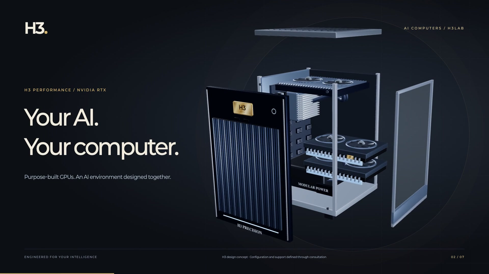
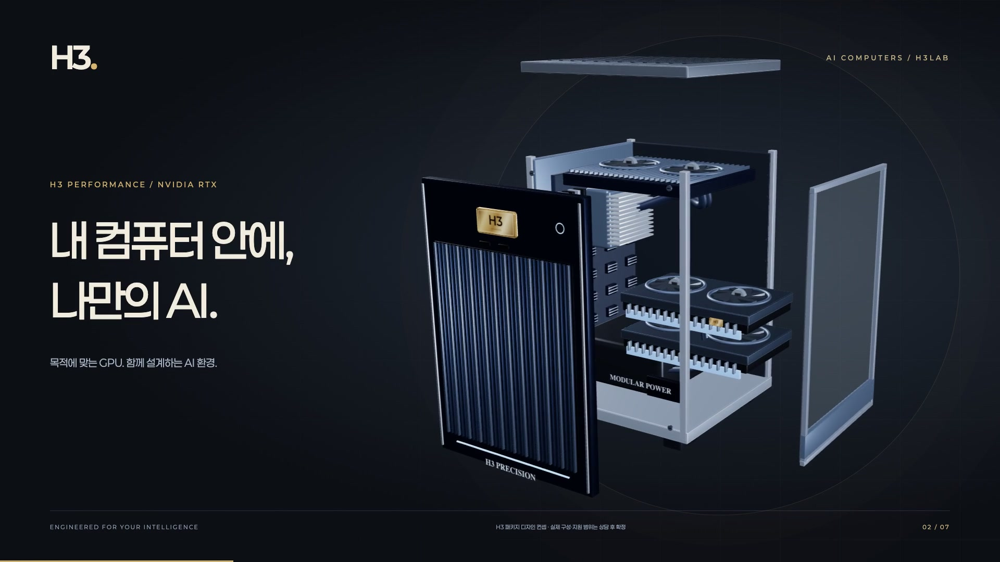
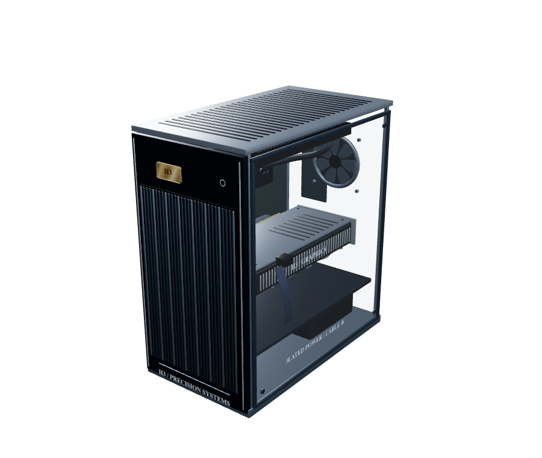
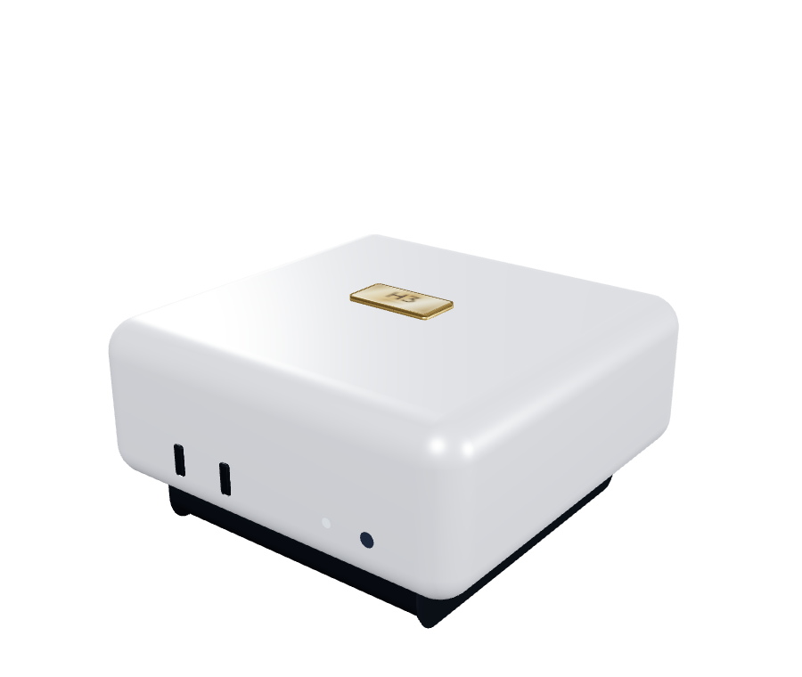
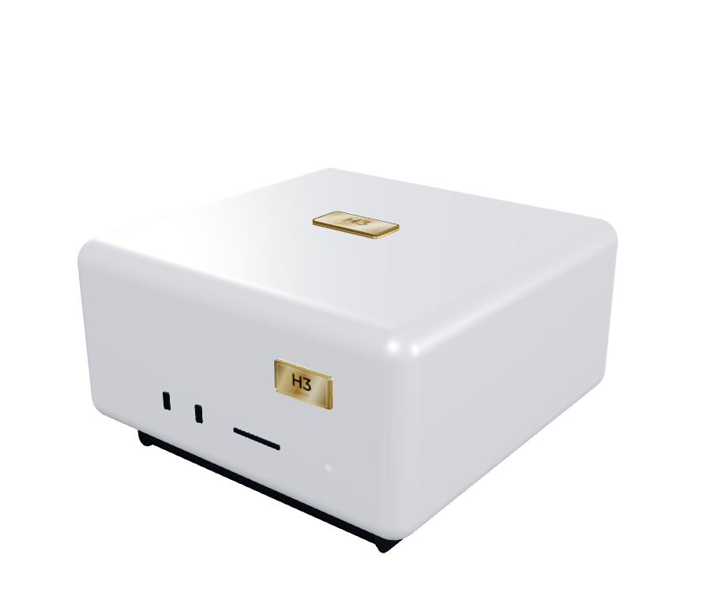
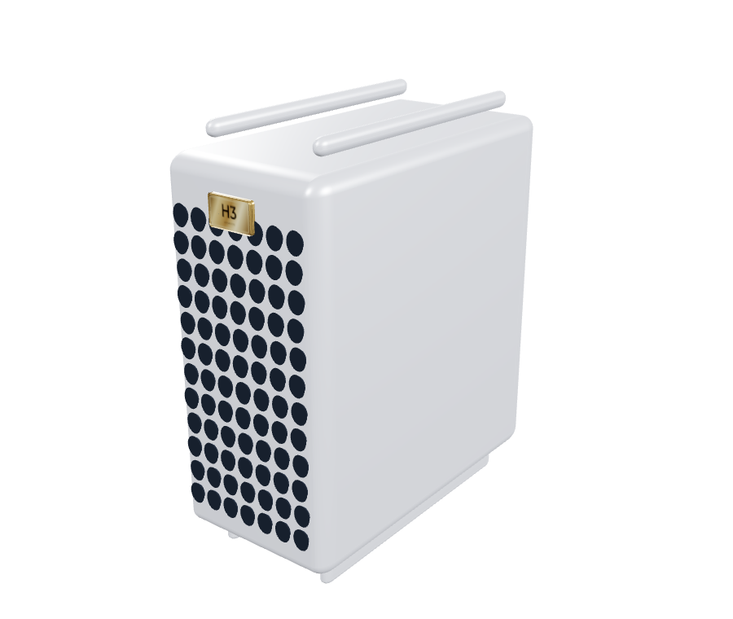
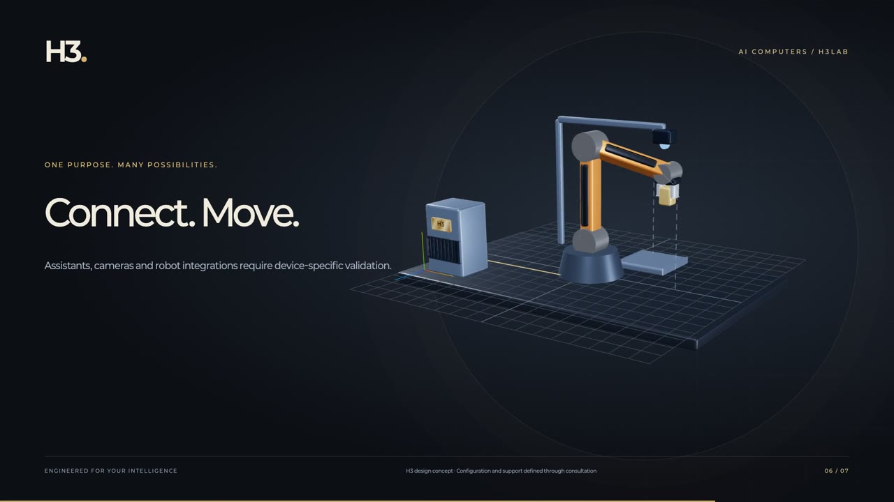

# H3 · AI Computers

**Create ideas. Move the world.**

[한국어](README.ko.md) · [H3Lab](https://h3lab.kr/) · [Product showcase](apps/web/README.md) · [Mac app guide](docs/public/MAC-APP.md) · [Contribute](CONTRIBUTING.md)

H3 is a **computer brand that designs hardware and AI together around your purpose**. Write, speak, create images and produce video. Our vision extends from a personal work assistant to a system that coordinates connected devices.

H3Lab builds on public models and the work of global runtime teams to create **AI environments people can put to work**. Choose the computer, connect the models and tools, and keep the results together in one workflow.

## Meet H3 in 30 seconds

From detailed hardware to a personal creative workspace and a future of connected devices. Our brand films bring the website’s 3D product designs to life. Select a poster to open the film in your language.

<table>
<tr>
<td width="50%" align="center"><a href="apps/web/public/media/h3-brand-film-en.mp4"><br><b>▶ English · 30 seconds</b></a></td>
<td width="50%" align="center"><a href="apps/web/public/media/h3-brand-film-ko.mp4"><br><b>▶ 한국어 · 30초</b></a></td>
</tr>
</table>

Full HD · AI-generated narration · Original music · Localized captions

## One computer. Many possibilities.

| Workspace | What you can do |
|---|---|
| **Chat** | Connect local models for documents, ideas and development; select a model and start a conversation |
| **Voice** | Generate Korean speech, select a speaker and preview narration as WAV audio |
| **Images** | Generate images with control over resolution, steps and seed; preview the result |
| **Video** | Generate video with audio through MiniMax H3, supply a starting image and use the default eight-step workflow |
| **Library** | Keep inputs, settings, original outputs and logs together; revisit recent work |

**The Mac app is currently developer Preview 0.3.** Its native SwiftUI interface brings chat, voice, image and video tools together with model connections and job records.

## AI computers designed around the work

Configuration starts with the models and workloads you want to run. GPU, memory, storage, power and cooling are designed alongside the runtime environment for individuals and teams.

<table>
<tr>
<td width="50%" align="center"><br><b>H3 Performance · NVIDIA RTX</b></td>
<td width="50%" align="center"><br><b>H3 Mini · Mac mini</b></td>
</tr>
<tr>
<td width="50%" align="center"><br><b>H3 Mac Studio</b></td>
<td width="50%" align="center"><br><b>H3 Mac Pro · Existing equipment</b></td>
</tr>
</table>

H3 package design concepts rendered from the website’s shared 3D models. Run the [product showcase](apps/web/README.md) to rotate the computers and explore the RTX enclosure.

| Product family | Design direction |
|---|---|
| **H3 Core · NVIDIA** | Personal productivity and small-scale creation |
| **H3 Studio · NVIDIA** | Image and video workflows for creators, developers and studios |
| **H3 Pro · NVIDIA** | Tailored configurations for research, production and internal AI |
| **H3 Mini · Mac mini** | A personal AI workspace with a small footprint |
| **H3 Mac Studio** | A creative environment connecting local models and production tools |
| **H3 Mac Pro** | AI integration for existing Apple Silicon Mac Pro equipment |

Explore configuration proposals and setup options in the [NVIDIA package guide](docs/public/NVIDIA-PACKAGES.md) and [Mac app guide](docs/public/MAC-APP.md).

## Experience H3

The bilingual brand website makes the products and the vision tangible.

- **Interactive 3D hardware:** open the RTX enclosure to explore cooling, circuitry and cabling; rotate the Mac packages.
- **Blue & Gold:** navy, blue and bright silver, gold H3 signature badges and Paperozi typography.
- **Robotics Lab:** experience request → approval → product movement in an interactive 3D simulation.
- **Korean & English:** localized product information, consultation forms, films, narration and captions.

## Create. Assist. Connect.



**From conversations and content to coordinated work.** The website’s Robotics Lab brings an H3 computer, robot arm and camera into one work cell. Start a product-photography request, approve the demonstration, pause the movement and resume it.

The interactive simulation explores **understand → plan → approve → act → review**. Real device connections will develop through hardware-specific validation.

## Start on Mac

Prepare an Apple Silicon Mac, macOS 14 or later, and Apple's Command Line Tools.

```sh
bash scripts/build-mac-app.sh
open "dist/H3.app"
```

1. Open **Models & Connections** and connect a local server or installed model and runtime.
2. Choose **Chat, Voice, Images or Video**.
3. **Prepare → Review settings → Generate**, then preview the result or open the original file.

Connect local servers such as LM Studio or Ollama, or a prepared MLX server. The [Mac app guide](docs/public/MAC-APP.md) covers installation and runtime requirements.

## Models and runtimes

| Role | Integrated model | Runtime |
|---|---|---|
| Chat | Qwen3.8-27B · MLX 8bit | MLX-VLM |
| Korean speech | Qwen3-TTS 1.7B CustomVoice · MLX 8bit | MLX-Audio |
| Images | FLUX.2 klein 4B | MFLUX |
| Video and audio | MiniMax H3 Turbo8 FL2VA | h3.c |

[Model selection rationale](docs/public/MODEL-SELECTION-20260909.md) · [Initial Mac M5 Max 128GB execution records](docs/public/MODEL-SCREEN-20260909.md)

## Build, verify and improve together

H3 records inputs, execution settings and results together. Reusable generation, editing and media-checking tools support compatibility and quality work on real tasks. The website includes a browser harness for product selection, consultation, language switching, mobile layouts, accessibility and film playback.

```text
apps/web/       Bilingual website · 3D products · Brand films
apps/macos/     Native SwiftUI H3 Mac app
assets/brand/   H3 brand assets
scripts/        App build and test scripts
examples/       Runnable production examples
tools/          Generation, editing, benchmarks and media checks
tests/          Toolkit tests
docs/public/    Setup, models, production and collaboration guides
```

Run the website locally:

```sh
cd apps/web
npm ci
npm run dev
```

[Web development and checks](apps/web/README.md) · [Production toolkit](docs/public/WORKFLOW.md) · [Contribution guide](CONTRIBUTING.md)

Next: guided model setup and recovery, resident workers, reference-based creation and NVIDIA runtime integration. Assistants, cameras and robot connections will expand through device-specific validation.

## License and collaboration

Project source is available under the [MIT License](LICENSE). External models, runtimes, fonts and media follow their respective providers' terms.

**Build AI computers with us.** We welcome collaboration on local runtimes, model compatibility, Korean speech, creative workflows and connected devices.

[GitHub](https://github.com/H3Lab-kr/H3-AIComputer) · [hi@h3lab.kr](mailto:hi@h3lab.kr)

---

<p align="center"><sub>“AI 컴퓨터” (AI Computer) was jointly branded and initiated by 정락현, 문아라 and 이강훈 on 2026-09-08.<br>© 2026 정락현 · 문아라 · 이강훈 — AI 컴퓨터 brand concept and branding.</sub></p>
